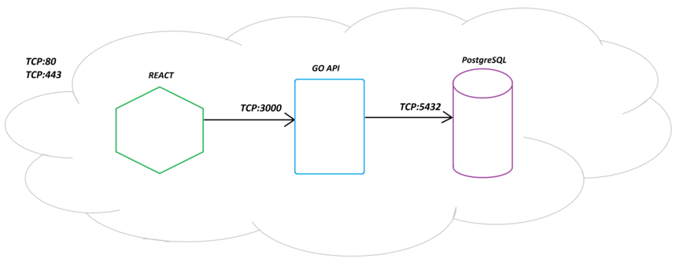

# Project Name
DelSurProps

## About the Project

### Purpose
The client has requested a solution that centralizes the properties they manage: For sale, Rentals, and Entrepreneurships.

### Solution
This site provides a quick overview of the real state in stock.
It is a solution built in React.js, which centralizes the properties on a single website and redirects the client to the link on MercadoLibre/Zonaprop/Argenprop, where they can find more information related to the property of their interest. 

### Link
- endearing-melomakarona-8df72e.netlify.app
- delsurprops.com.ar was shut down as per client request.
- Video of the working app w/ backend and frontend: https://youtu.be/kzu_LFJki7s

### Full stack architecture
This is a full-stack project, designed to work in conjunction with this backend: [https://github.com/Matias-Ramos/Inmobiliaria-backend-go] and with an SQL database.
The filtering and ADM (Add, Delete, Modify) are made in the backend.

### Challenges on this project:
- Global state management with useContext.
- Complex/Multiple state management with useReducer.
- Advanced filtering in sync with URL, with useEffect.
- Developed distinct UIs for user and admin roles.
- Integrated an organic (moving) background for the first time.
- Implemented Framer Motion for the first time.
- Backend API integration.
- Prioritized user-friendly interface design.

## Code

### Pages & Core components
- Welcome.jsx (/)
- Main.jsx (/emprendimientos, /alquiler_inmuebles, /venta_inmuebles)
  - header > Navbar.jsx
  - main > FiltersContainer.jsx
  - main > GalleryContainer.jsx
  - footer > Attributions.jsx
- AdminPanel.jsx (/admin)
  - create > ContainerCreateBuilding.jsx
  - delete > ContainerDeleteBuilding.jsx
- RouteError.jsx

### Frameworks & Libraries
- react-bootstrap (grid and box modeling)
- MaterialUi (components)
- Framermotion (animation)

### Stock Update Method

https://localhost/admin

### **Important** note for developers
If the viewport is modified from a browser (desktop view to mobile view or vice versa), it will be necessary to refresh the page, since there are some components that are not dynamically adaptable. Basically, due to the cost benefit it represented to do that, I decided not to.

### Running the Project
1. git clone https://github.com/Matias-Ramos/DelSurProps-FrontEnd.git
2. cd on the directory
3. IDE terminal: npm install
4. IDE terminal: npm run dev
5. Go to the url [http://127.0.0.1:5173/] in the browser to see the app working.

### Project Initialization
The project was initialized with Vite.
